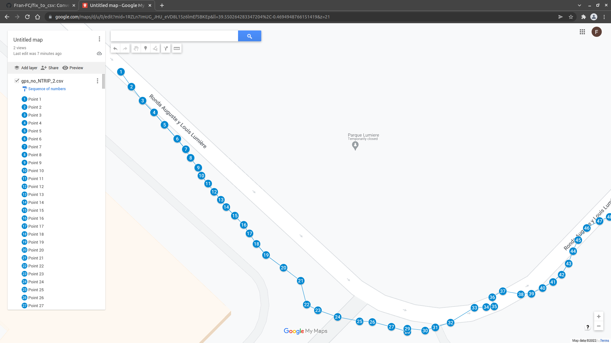
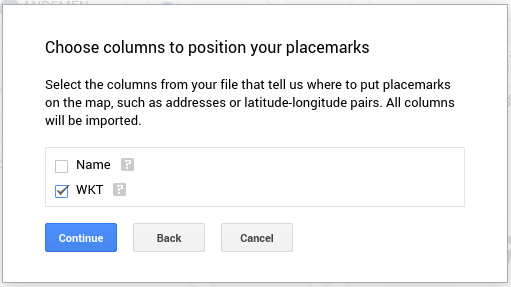
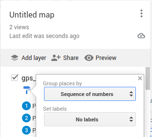

# fix_to_csv

Convert gps fix topic (ROS) to csv map format to open it with My Maps (Google).

## Usage

- Clone this repo in your catkin workspace and build it.
- Config file:
  - Change the topic name to subscribe (messages must be of type sensor_msgs/NavSatFix).
  - Choose the name and absolute path of the output file.
- Launch the node:`roslaunch fix_to_csv fix_to_csv.launch`
- When finished recording, press Ctrl+C.

## CSV file visualization

To visualize the stored .csv file, go to [My Maps](https://mymaps.google.com/) and create a new map. Then select to import the csv file,
choose the WKT column for the placemarks and the Name column to title the markers.

Then you can group places by sequence of numbers.

